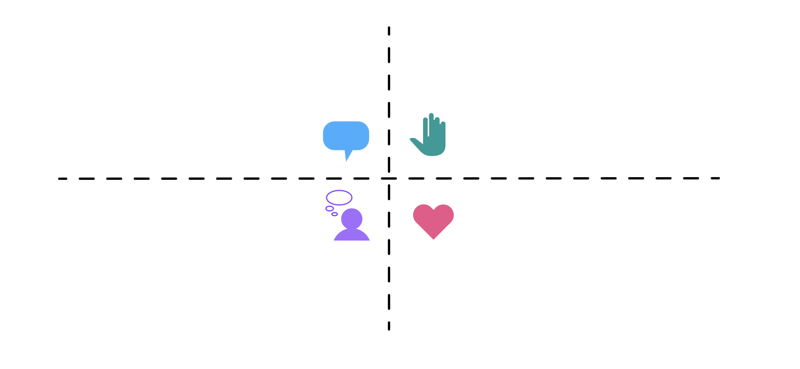

# La importancia de la empatía en Design Thinking

### ¿En qué consiste la empatía?
La empatía es el primer paso en *Design Thinking* porque permite comprender y compartir los sentimientos de los demás. Nos ayuda a ponernos en el lugar del usuario y conectar con sus experiencias, problemas y necesidades. Una gran parte de *Design Thinking* se enfoca en el impacto que el pensamiento innovador tiene en las personas.

### ¿Qué es un mapa de empatía?
Antes de resolver un problema, es fundamental comprender al usuario. Los mapas de empatía ayudan a profundizar en esta comprensión y a visualizar mejor el comportamiento del usuario.

#### Creación de un perfil del usuario
En *Design Thinking*, se utiliza la actividad del *mapa de empatía* para representar de manera realista a los usuarios. Un perfil puede incluir detalles como:
- Formación y experiencia
- Estilo de vida e intereses
- Valores y metas
- Necesidades y pensamientos
- Deseos y actitudes
- Acciones y comportamientos

Los mapas de empatía facilitan la identificación de problemas y oportunidades de mejora, permitiendo diseñar soluciones más efectivas y centradas en el usuario.

