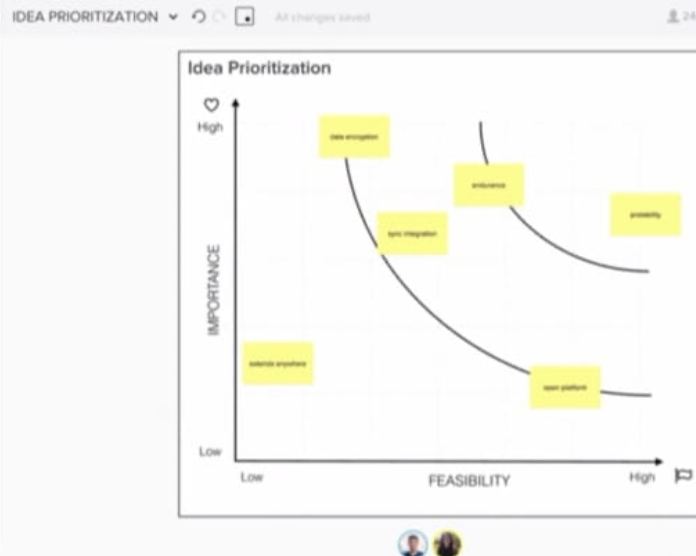
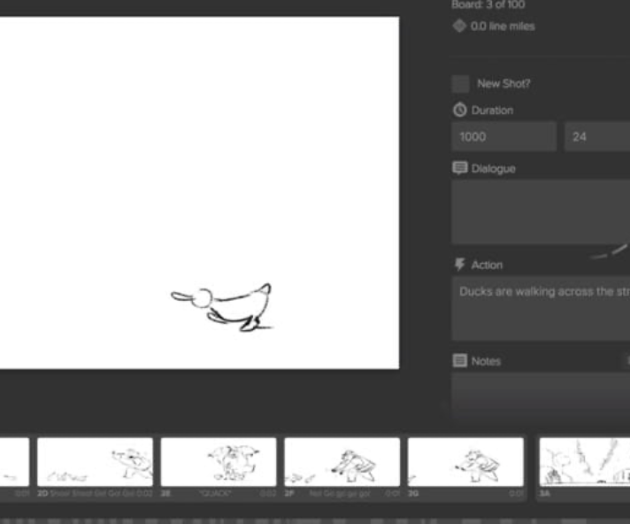
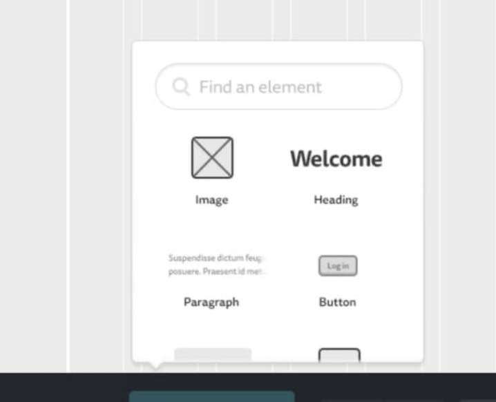

# Herramientas para Design Thinking
## Herramientas Físicas
El Design Thinking requiere materiales básicos pero fundamentales para funcionar correctamente:

### Tablero o pizarra grande: 
 Suficientemente amplio para que todo el equipo pueda ver y participar simultáneamente. Si no tienes una, puedes usar carteles o rotafolios.

### Notas adhesivas:

 Elementos esenciales que permiten mover y reorganizar ideas durante las sesiones colaborativas.

### Marcadores: 
Tanto borrables para pizarras como permanentes para notas adhesivas. Son preferibles a bolígrafos porque evitan el exceso de detalles y mejoran la visibilidad.

### Espacio adecuado:
 Idealmente para equipos de unas cinco personas, con suficiente amplitud para que todos puedan levantarse y moverse, lo que favorece diferentes perspectivas del proyecto.

## Herramientas Digitales
Cuando no es posible reunirse físicamente, existen diversas herramientas digitales que facilitan el Design Thinking:

### Herramientas de Comunicación

Permiten que varios miembros del equipo conversen simultáneamente, preferiblemente con funciones de video para ver y escuchar a todos.

Ejemplos: Skype, Zoom, WebEx, Google Chat, Slack

### Herramientas de Pizarra Virtual

Sustituyen a las pizarras físicas, permitiendo colaborar visualmente con equipos dispersos geográficamente.

Ejemplos: Mural, Miro, Sketchboard, Stormboard, Trello

### Herramientas de Creación de Guiones Gráficos

Facilitan la creación de storyboards para visualizar secuencias de escenas.

Ejemplos: Storyboarder, Canva, Boords, Plot

### Herramientas de Wireframing e Interfaz de Usuario

Especialmente útiles para desarrollo de software y aplicaciones, permiten probar interfaces de usuario.

Ejemplos: Mockingbird, POP, Axure

## Consideraciones Importantes
Como menciona Sarah B. Nelson de IBM, el Design Thinking tiene una gran ventaja: requiere muy poca fidelidad y puede practicarse prácticamente en cualquier lugar. Lo fundamental es tener "algo para escribir, algo sobre lo cual escribir y alguien que lo haga".
Es importante recordar que, aunque las herramientas son necesarias, el Design Thinking se centra más en el proceso que en el producto final de las actividades. La clave está en la colaboración, la creatividad y la capacidad de adaptación del equipo.

